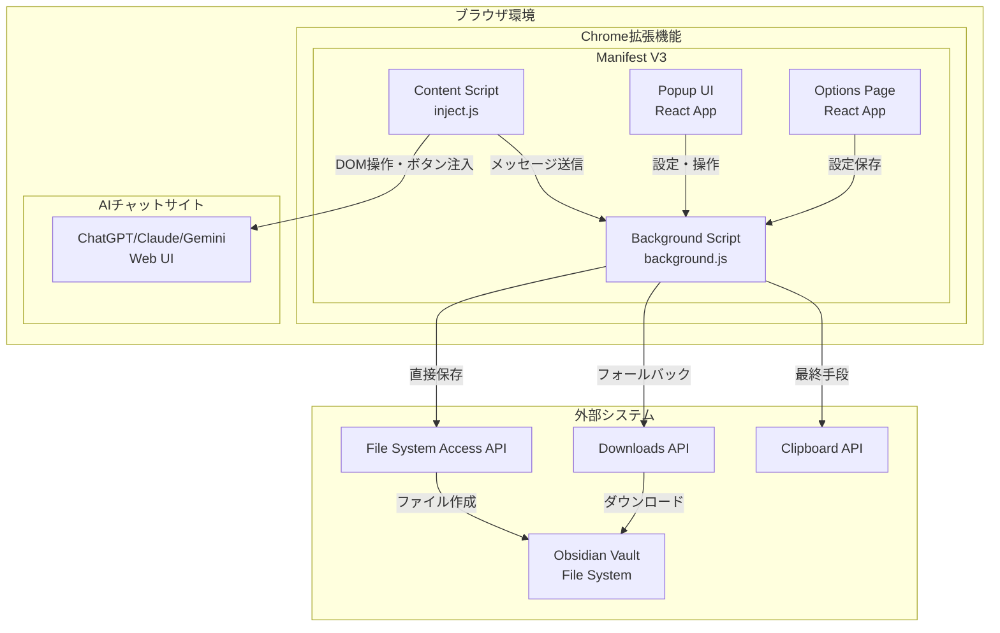
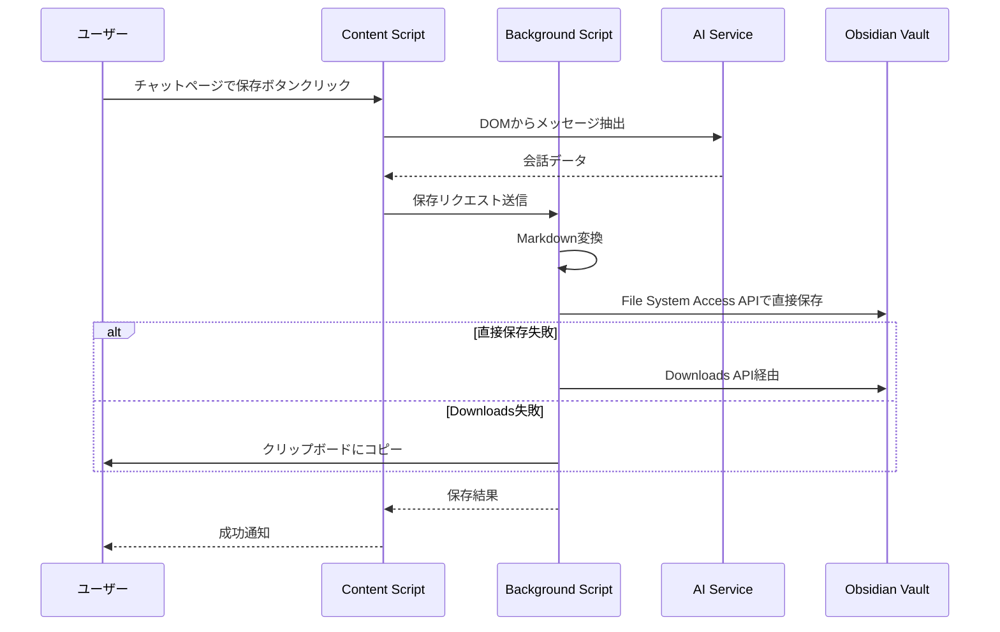
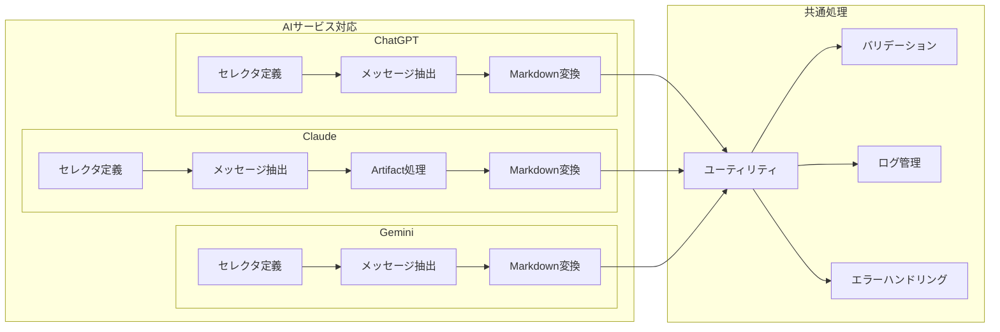
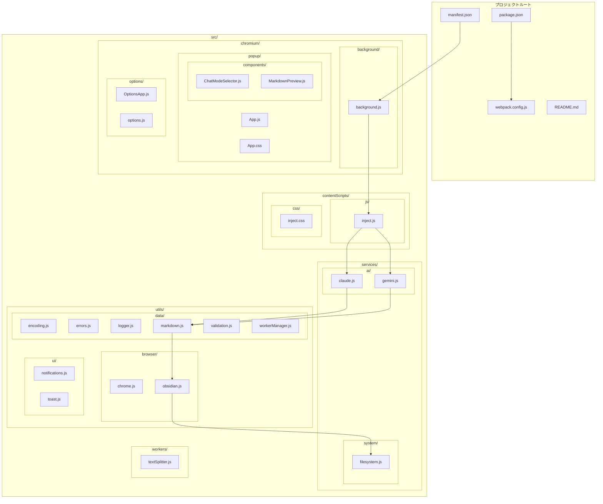
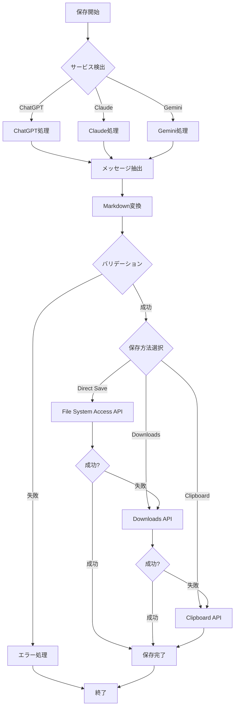
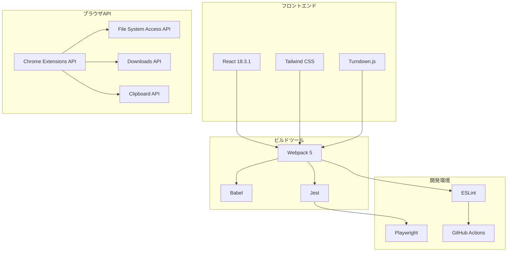
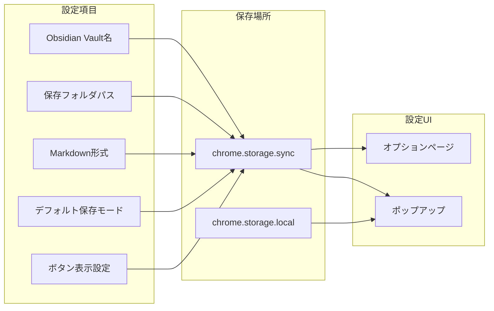
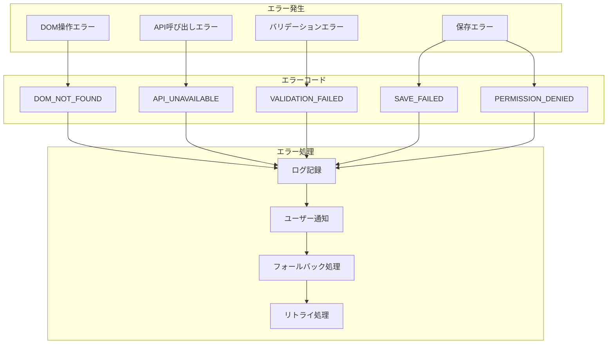

# Chat Clip Obsidian プロジェクトアーキテクチャ

## システム概要図

```mermaid
graph TB
    subgraph "ブラウザ環境"
        subgraph "Chrome拡張機能"
            subgraph "Manifest V3"
                BG[Background Script<br/>background.js]
                CS[Content Script<br/>inject.js]
                POP[Popup UI<br/>React App]
                OPT[Options Page<br/>React App]
            end
        end
        
        subgraph "AIチャットサイト"
            CHAT[ChatGPT/Claude/Gemini<br/>Web UI]
        end
    end
    
    subgraph "外部システム"
        OBS[Obsidian Vault<br/>File System]
        FS[File System Access API]
        DOWN[Downloads API]
        CLIP[Clipboard API]
    end
    
    CS -->|DOM操作・ボタン注入| CHAT
    CS -->|メッセージ送信| BG
    POP -->|設定・操作| BG
    OPT -->|設定保存| BG
    
    BG -->|直接保存| FS
    BG -->|フォールバック| DOWN
    BG -->|最終手段| CLIP
    FS -->|ファイル作成| OBS
    DOWN -->|ダウンロード| OBS
```

## データフロー図

```mermaid
sequenceDiagram
    participant User as ユーザー
    participant CS as Content Script
    participant BG as Background Script
    participant Service as AI Service
    participant Obsidian as Obsidian Vault
    
    User->>CS: チャットページで保存ボタンクリック
    CS->>Service: DOMからメッセージ抽出
    Service-->>CS: 会話データ
    CS->>BG: 保存リクエスト送信
    BG->>BG: Markdown変換
    BG->>Obsidian: File System Access APIで直接保存
    alt 直接保存失敗
        BG->>Obsidian: Downloads API経由
    else Downloads失敗
        BG->>User: クリップボードにコピー
    end
    BG-->>CS: 保存結果
    CS-->>User: 成功通知
```

## サービス別アーキテクチャ

```mermaid
graph LR
    subgraph "AIサービス対応"
        subgraph "ChatGPT"
            CG_SEL[セレクタ定義]
            CG_EXT[メッセージ抽出]
            CG_MD[Markdown変換]
        end
        
        subgraph "Claude"
            CL_SEL[セレクタ定義]
            CL_EXT[メッセージ抽出]
            CL_ART[Artifact処理]
            CL_MD[Markdown変換]
        end
        
        subgraph "Gemini"
            GM_SEL[セレクタ定義]
            GM_EXT[メッセージ抽出]
            GM_MD[Markdown変換]
        end
    end
    
    subgraph "共通処理"
        UTIL[ユーティリティ]
        VALID[バリデーション]
        LOG[ログ管理]
        ERROR[エラーハンドリング]
    end
    
    CG_SEL --> CG_EXT --> CG_MD
    CL_SEL --> CL_EXT --> CL_ART --> CL_MD
    GM_SEL --> GM_EXT --> GM_MD
    
    CG_MD --> UTIL
    CL_MD --> UTIL
    GM_MD --> UTIL
    UTIL --> VALID
    UTIL --> LOG
    UTIL --> ERROR
```

## ファイル構造図

```mermaid
graph TD
    subgraph "プロジェクトルート"
        PKG[package.json]
        MAN[manifest.json]
        WEB[webpack.config.js]
        READ[README.md]
    end
    
    subgraph "src/"
        subgraph "chromium/"
            subgraph "background/"
                BG_JS[background.js]
            end
            subgraph "popup/"
                POP_JS[App.js]
                POP_CSS[App.css]
                subgraph "components/"
                    CMS[ChatModeSelector.js]
                    MPS[MarkdownPreview.js]
                end
            end
            subgraph "options/"
                OPT_JS[OptionsApp.js]
                OPT_MAIN[options.js]
            end
        end
        
        subgraph "contentScripts/"
            subgraph "js/"
                INJ_JS[inject.js]
            end
            subgraph "css/"
                INJ_CSS[inject.css]
            end
        end
        
        subgraph "services/"
            subgraph "ai/"
                CLD[claude.js]
                GEM[gemini.js]
            end
            subgraph "system/"
                FS[filesystem.js]
            end
        end
        
        subgraph "utils/"
            subgraph "browser/"
                CHR[chrome.js]
                OBS[obsidian.js]
            end
            subgraph "data/"
                ENC[encoding.js]
                ERR[errors.js]
                LOG[logger.js]
                MD[markdown.js]
                VAL[validation.js]
                WM[workerManager.js]
            end
            subgraph "ui/"
                NOT[notifications.js]
                TOAST[toast.js]
            end
        end
        
        subgraph "workers/"
            TS[textSplitter.js]
        end
    end
    
    PKG --> WEB
    MAN --> BG_JS
    BG_JS --> INJ_JS
    INJ_JS --> CLD
    INJ_JS --> GEM
    CLD --> MD
    GEM --> MD
    MD --> OBS
    OBS --> FS
```

## 保存フロー図

```mermaid
flowchart TD
    START[保存開始] --> DETECT{サービス検出}
    DETECT -->|ChatGPT| CG[ChatGPT処理]
    DETECT -->|Claude| CL[Claude処理]
    DETECT -->|Gemini| GM[Gemini処理]
    
    CG --> EXTRACT[メッセージ抽出]
    CL --> EXTRACT
    GM --> EXTRACT
    
    EXTRACT --> CONVERT[Markdown変換]
    CONVERT --> VALIDATE{バリデーション}
    VALIDATE -->|失敗| ERROR[エラー処理]
    VALIDATE -->|成功| SAVE_METHOD{保存方法選択}
    
    SAVE_METHOD -->|Direct Save| FS_SAVE[File System Access API]
    SAVE_METHOD -->|Downloads| DOWN_SAVE[Downloads API]
    SAVE_METHOD -->|Clipboard| CLIP_SAVE[Clipboard API]
    
    FS_SAVE --> FS_CHECK{成功?}
    FS_CHECK -->|失敗| DOWN_SAVE
    DOWN_SAVE --> DOWN_CHECK{成功?}
    DOWN_CHECK -->|失敗| CLIP_SAVE
    
    FS_CHECK -->|成功| SUCCESS[保存完了]
    DOWN_CHECK -->|成功| SUCCESS
    CLIP_SAVE --> SUCCESS
    
    ERROR --> END[終了]
    SUCCESS --> END
```

## 技術スタック図

```mermaid
graph TB
    subgraph "フロントエンド"
        REACT[React 18.3.1]
        TAIL[Tailwind CSS]
        TURNDOWN[Turndown.js]
    end
    
    subgraph "ビルドツール"
        WEBPACK[Webpack 5]
        BABEL[Babel]
        JEST[Jest]
    end
    
    subgraph "ブラウザAPI"
        CHROME[Chrome Extensions API]
        FS_API[File System Access API]
        DOWN_API[Downloads API]
        CLIP_API[Clipboard API]
    end
    
    subgraph "開発環境"
        PLAYWRIGHT[Playwright]
        ESLINT[ESLint]
        GITHUB[GitHub Actions]
    end
    
    REACT --> WEBPACK
    TAIL --> WEBPACK
    TURNDOWN --> WEBPACK
    WEBPACK --> BABEL
    WEBPACK --> JEST
    
    CHROME --> FS_API
    CHROME --> DOWN_API
    CHROME --> CLIP_API
    
    JEST --> PLAYWRIGHT
    WEBPACK --> ESLINT
    ESLINT --> GITHUB
```

## 設定管理図

```mermaid
graph LR
    subgraph "設定項目"
        VAULT[Obsidian Vault名]
        FOLDER[保存フォルダパス]
        FORMAT[Markdown形式]
        MODE[デフォルト保存モード]
        BUTTON[ボタン表示設定]
    end
    
    subgraph "保存場所"
        SYNC[chrome.storage.sync]
        LOCAL[chrome.storage.local]
    end
    
    subgraph "設定UI"
        OPTIONS[オプションページ]
        POPUP[ポップアップ]
    end
    
    VAULT --> SYNC
    FOLDER --> SYNC
    FORMAT --> SYNC
    MODE --> SYNC
    BUTTON --> SYNC
    
    SYNC --> OPTIONS
    SYNC --> POPUP
    LOCAL --> POPUP
```

## エラーハンドリング図

```mermaid
graph TD
    subgraph "エラー発生"
        DOM_ERR[DOM操作エラー]
        API_ERR[API呼び出しエラー]
        VAL_ERR[バリデーションエラー]
        SAVE_ERR[保存エラー]
    end
    
    subgraph "エラー処理"
        LOG_ERR[ログ記録]
        USER_MSG[ユーザー通知]
        FALLBACK[フォールバック処理]
        RETRY[リトライ処理]
    end
    
    subgraph "エラーコード"
        E001[DOM_NOT_FOUND]
        E002[API_UNAVAILABLE]
        E003[VALIDATION_FAILED]
        E004[SAVE_FAILED]
        E005[PERMISSION_DENIED]
    end
    
    DOM_ERR --> E001
    API_ERR --> E002
    VAL_ERR --> E003
    SAVE_ERR --> E004
    SAVE_ERR --> E005
    
    E001 --> LOG_ERR
    E002 --> LOG_ERR
    E003 --> LOG_ERR
    E004 --> LOG_ERR
    E005 --> LOG_ERR
    
    LOG_ERR --> USER_MSG
    USER_MSG --> FALLBACK
    FALLBACK --> RETRY
```
